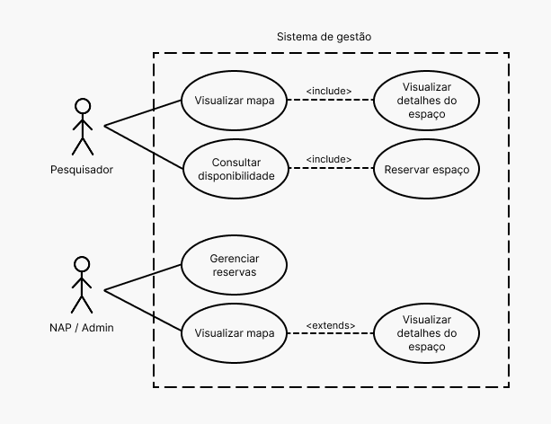

# Documento de Requisitos de software - Embrapa Cenargen: CVGWeb 

**Centro Universitário de Brasília (CEUB)**  
**Data:** 02/09/2026  
**Disciplina:** Projeto Integrador IV  
**Semestre:** 8º semestre  

**Professor/Orientador:** Tiago Leite Pereira

### Alunos

- Felipe Tolentino Soares
- Lucas Daniel Paiva de Sá
- Luis Guilherme Andrade Palhares de Melo
- Miguel Artur de Castro Miranda
- Lucas Andrade Fonseca

---

## Sumário

1. [Introdução](#1-introdução)
2. [Descrição Geral](#2-descrição-geral)
3. [Requisitos do Sistema](#3-requisitos-do-sistema)
4. [Regras de Negócio](#4-regras-de-negócio)
5. [Considerações Finais](#5-considerações-finais)
6. [Referências](#6-referências)

# 1. Introdução

## 1.1 Propósito

Este documento, desenvolvido no contexto da disciplina **Projeto Integrador IV** do Centro Universitário de Brasília (CEUB), tem como objetivo especificar os requisitos do **Sistema de Gestão de Campos Experimentais da Embrapa Cenargen – CVGWeb**.

O documento servirá como referência para as etapas de desenvolvimento, validação, implementação e testes da solução proposta.

## 1.2 Escopo

O sistema será desenvolvido como uma aplicação web destinada ao gerenciamento da utilização de campos experimentais e casas de vegetação da Embrapa Cenargen.

A solução deverá possibilitar a organização do uso desses espaços, contemplando o cadastro de pesquisadores e projetos de pesquisa, o registro e acompanhamento de reservas, a consulta da disponibilidade dos ambientes e a geração de informações que possam apoiar o processo de gestão da infraestrutura experimental.

## 1.3 Definições, Acrônimos e Abreviações

Para fins deste documento, entende-se por **campo experimental** e **casa de vegetação** os espaços destinados à realização de atividades experimentais e de pesquisa.

O termo **NAP** refere-se ao **Núcleo de Apoio à Pesquisa**, responsável pela organização e acompanhamento da utilização dos espaços experimentais.

## 1.5 Visão Geral

Este documento está organizado em seções que apresentam a descrição geral do sistema, os usuários envolvidos, as principais funcionalidades, as restrições e dependências, os requisitos funcionais e não funcionais, as regras de negócio e as considerações finais do projeto.

---

# 2. Descrição Geral

## 2.1 Perspectiva do Produto

O sistema será desenvolvido como uma aplicação web acessível por meio de navegadores. A solução será composta por uma camada de apresentação, responsável pela interação com os usuários, uma camada de aplicação, responsável pelo processamento das regras e funcionalidades, e uma camada de persistência destinada ao armazenamento das informações em banco de dados.

## 2.1.1 Representação Funcional do Sistema

A representação funcional do sistema poderá ser apresentada por meio de um **diagrama de casos de uso**, contemplando as principais interações entre os diferentes perfis de usuários e as funcionalidades disponibilizadas pela aplicação.

## 2.2 Usuários do Sistema

### Pesquisadores

Responsáveis pela realização de experimentos científicos e pela solicitação de utilização dos campos experimentais e casas de vegetação.

### Equipe do Núcleo de Apoio à Pesquisa (NAP)

Responsável pela organização, controle e acompanhamento da utilização dos espaços experimentais.

### Gestores/Administradores

Responsáveis pelo acompanhamento da utilização da infraestrutura e pela análise das informações disponibilizadas pelo sistema.

## 2.3 Funcionalidades Principais

O sistema deverá disponibilizar, entre outras, as seguintes funcionalidades:

* Visualização dos espaços experimentais;
* Consulta da disponibilidade dos espaços;
* Cadastro de pesquisadores;
* Cadastro de projetos de pesquisa;
* Cadastro e gerenciamento de espaços experimentais;
* Registro de reservas;
* Visualização e acompanhamento das reservas realizadas;

## 2.4 Restrições

* O sistema será desenvolvido como um **protótipo acadêmico** no âmbito da disciplina Projeto Integrador IV;
* Nesta versão, não estão previstas integrações com sistemas externos;
* O acesso ao sistema será realizado exclusivamente por meio de navegador web;
* Os dados necessários ao funcionamento da aplicação serão inseridos e gerenciados pelos usuários autorizados.

## 2.5 Assunções e Dependências

* Os usuários deverão possuir acesso a um dispositivo compatível com navegador web;
* As informações necessárias para os cadastros deverão ser fornecidas pelos responsáveis pelo uso do sistema;
* A solução será utilizada em ambiente controlado para fins acadêmicos e de validação do protótipo;
* O funcionamento adequado do sistema dependerá da disponibilidade da infraestrutura necessária para sua execução.

---

# 3. Requisitos do Sistema

## 3.1 Requisitos Funcionais

### RF01 — Visualizar espaços

O sistema deve permitir a visualização dos campos experimentais e das casas de vegetação de forma organizada, apresentando as informações necessárias para sua identificação.

### RF02 — Consultar disponibilidade

O sistema deve permitir a consulta da disponibilidade dos espaços considerando períodos específicos.

### RF03 — Cadastrar pesquisadores

O sistema deve permitir o cadastro, a edição e a remoção das informações dos pesquisadores.

### RF04 — Cadastrar projetos

O sistema deve permitir o cadastro, a edição e o gerenciamento das informações referentes aos projetos de pesquisa.

### RF05 — Cadastrar espaços experimentais

O sistema deve permitir o cadastro e a manutenção das informações referentes aos espaços experimentais disponíveis.

### RF06 — Registrar reservas

O sistema deve permitir o registro de reservas associando um pesquisador, um projeto, um espaço experimental e um período de utilização.

### RF07 — Visualizar reservas

O sistema deve permitir a visualização das reservas realizadas, possibilitando o acompanhamento da ocupação dos espaços.

---

## 3.2 Requisitos Não Funcionais

### RNF01 — Usabilidade

O sistema deve apresentar uma interface simples, clara e de fácil utilização, considerando os diferentes perfis de usuários previstos.

### RNF02 — Desempenho

O sistema deve responder às ações realizadas pelos usuários em tempo adequado, proporcionando uma experiência satisfatória durante a utilização.

### RNF03 — Segurança

O sistema deve implementar mecanismos básicos de controle de acesso e preservar a integridade das informações armazenadas.

### RNF04 — Disponibilidade

O sistema deverá permanecer disponível durante os períodos destinados à utilização e avaliação do protótipo acadêmico.

### RNF05 — Manutenibilidade

O sistema deve ser estruturado de forma organizada, favorecendo a manutenção, a correção de problemas e a evolução futura da solução.

---

# 4. Regras de Negócio

### RN01

Um espaço experimental não poderá ser reservado por mais de um pesquisador durante o mesmo período.

### RN02

Toda reserva deverá estar associada a um projeto de pesquisa.

### RN03

Um pesquisador deverá estar vinculado a pelo menos um projeto de pesquisa.

### RN04

A disponibilidade de um espaço deverá ser atualizada após o registro de uma reserva.

---

# 5. Considerações Finais

O **Sistema de Gestão de Campos Experimentais da Embrapa Cenargen – CVGWeb** proposto neste documento tem como finalidade contribuir para a organização, o controle e o acompanhamento da utilização dos espaços destinados às atividades experimentais.

No contexto acadêmico do **Projeto Integrador IV**, a especificação apresentada estabelece uma referência para o desenvolvimento e a avaliação da solução, permitindo que as funcionalidades e características esperadas sejam verificadas de maneira estruturada.

---

# 6. Referências

* **EMBRAPA – Empresa Brasileira de Pesquisa Agropecuária.**
  Disponível em: https://www.embrapa.br
  Acesso em: 02 set. 2026.

* **EMBRAPA Recursos Genéticos e Biotecnologia (Cenargen).**
  Disponível em: https://www.embrapa.br/recursos-geneticos-e-biotecnologia
  Acesso em: 02 set. 2026.

* **IEEE.** Prática Recomendada Para Especificações de Exigências de Software (IEEE 830).
